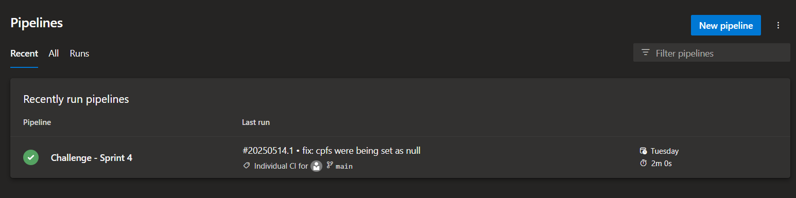
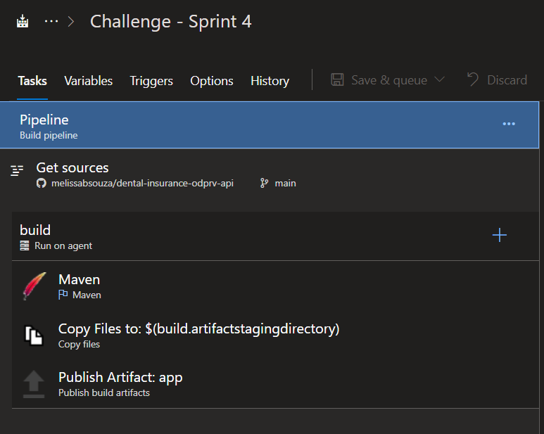
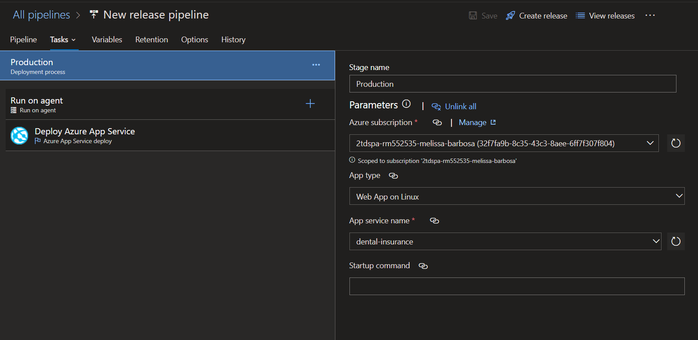
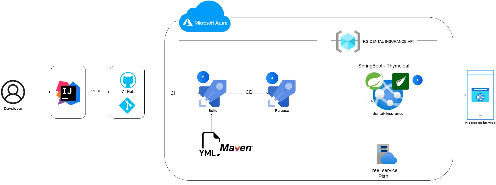

# Dental Insurance API

#### Visão Geral

A API Dental Insurance gerencia dados de clínicas odontológicas, pacientes, dentistas e atendimentos, servindo como base para um aplicativo móvel de armazenamento de informações sobre sinistros odontológicos. Ela permite operações CRUD para essas entidades, oferecendo um maior controle para administração dos dados. Essas informações serão usadas para rastrear sinistros relacionados aos atendimentos.

O projeto tem funcionalidades de front-end utilizando Thymeleaf integrado ao MongoDB Atlas. 
A aplicação é implantada no Azure Web App para ser acessada através de um navegador.

---

### Vídeo
https://www.youtube.com/watch?v=pt3rRMNS7k8

---
### URL DO WEBAPP

https://dental-insurance.azurewebsites.net/

---

### Azure Pipelines

Organization no Azure DevOps: 
https://dev.azure.com/RM552535/2TDSPA%20-%20ENTREGAS%20-%20AMN

### Configurações
Build:

Usando template do Maven:

Release:

---

## Diagrama

---

### Equipe do Projeto

### 🚀 Integrantes

### 1. Alissa Silva Cezero - RM 553954
  ### [GitHub/lissCez](https://github.com/lissCez)

### 2. Melissa Barbosa de Souza - RM 552535
  ### [GitHub/melissabsouza](https://github.com/melissabsouza)

### 3. Nicolas Paiffer do Carmo - RM 554145
  ### [GitHub/NPaiffer](https://github.com/NPaiffer) 

